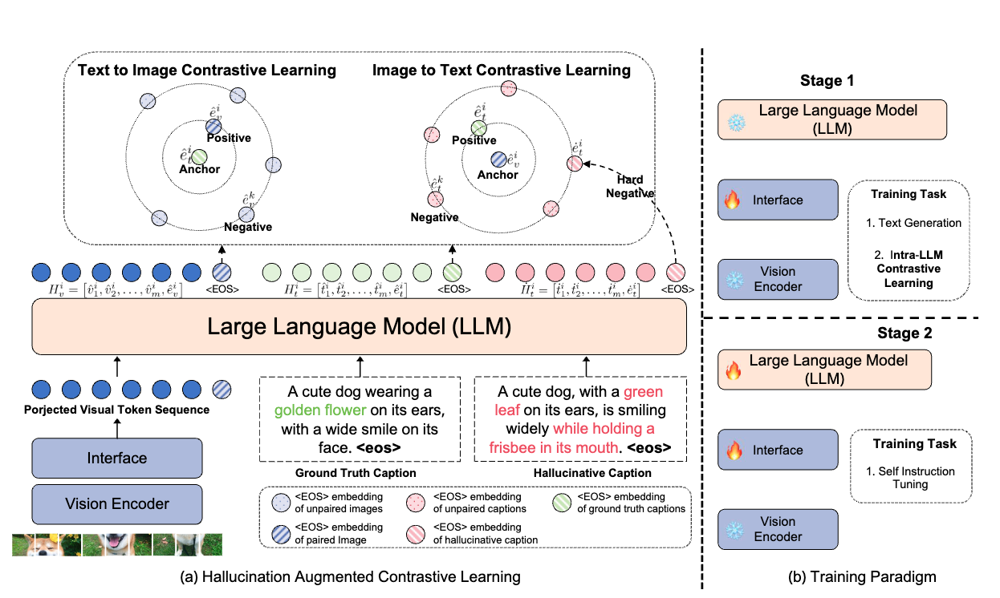

# Shell-V: Large vision-language language models based on Shell developed by PKU-KCL

<p align="center">
  🤗 <a href="https://huggingface.co/WisdomShell" target="_blank">Hugging Face</a>  • ⭕️ <a href="https://www.wisemodel.cn/models/WisdomShell/CodeShell-7B" target="_blank">WiseModel</a> • 🌐 <a href="http://se.pku.edu.cn/kcl/" target="_blank">PKU-KCL</a> •  🤖  <a href="http://27.188.73.160:7102/" target="_blank">Demo</a> 
 
</p>

<p align="center">

  [](https://github.com/WisdomShell/codeshell/blob/main/License.pdf)

</p>


<p align="center">
    
<p>

Our work is based on the following papers:

**Hallucination Augmented Contrastive Learning for Multimodal Large Language Model** (CVPR 2024) [[Paper](https://arxiv.org/abs/2312.06968)] [[Code](https://github.com/X-PLUG/mPLUG-HalOwl)] <br>
Chaoya Jiang, Haiyang Xu, Mengfan Dong, Jiaxing Chen, Wei Ye*, Ming Yan, Qinghao Ye, Ji Zhang, Fei Huang, Shikun Zhang. (*Corresponding Author)


**Hal-Eval: A Universal and Fine-grained Hallucination Evaluation Framework for Large Vision Language Models.** (Under review) [[Paper](https://arxiv.org/abs/2402.15721)] [[Code](https://github.com/WisdomShell/hal-eval)]  <br>
Chaoya Jiang, Wei Ye*, Mengfan Dong, Hongrui Jia, Haiyang Xu, Ming Yan, Ji Zhang, Shikun Zhang.  (*Corresponding Author)


**Visual Instruction Tuning** (NeurIPS 2023, **Oral**) [[Paper](https://arxiv.org/abs/2304.08485)]<br>
[Haotian Liu*](https://hliu.cc), [Chunyuan Li*](https://chunyuan.li/), [Qingyang Wu](https://scholar.google.ca/citations?user=HDiw-TsAAAAJ&hl=en/), [Yong Jae Lee](https://pages.cs.wisc.edu/~yongjaelee/) (*Equal Contribution)


## News
- [3/2]  🔥 We will release the pretraining and finetuneing datasets.
- [2/27] 🔥 We have released the model weights of Shell-V.
- [2/27] 🔥 Our paper ["Hallucination Augmented Contrastive Learning for Multimodal Large Language Model"](https://arxiv.org/abs/2312.06968) is accepted by CVPR 2024.
- [2/27] 🔥 We have released the training and finetuning code of Shell-V.

<!-- <a href="https://shell_v.hliu.cc/"></a> -->

## Introduction


<p align="center">

</p>

Our model, Shell-V, contructed based on the structure of [LLaVA1.5](https://arxiv.org/pdf/2310.03744.pdf) and Large Language Model [Shell](https://github.com/WisdomShell/shell), has further undertaken targeted enhancement in terms of representational learning (Hallucination Augumented Contrastive Learning) and Self Instruction Finetuning of LVLMs, which hones multi-modal hallucination (Kindly refer to our above papers for comprehensive details). Empirical evidence corroborates that Shell-V possesses the capability to effectively mitigate hallucination.  It has attained state-of-the-art performances across multiple multimodal hallucination evaluation benchmarks (such [MMhal-Eval](https://arxiv.org/pdf/2309.14525.pdf), [Hal-Eval](https://arxiv.org/abs/2402.15721), [POPE](https://arxiv.org/pdf/2305.10355.pdf)).

## Install

1. Clone this repository and navigate to shell_v folder
```bash
git clone https://github.com/WisdomShell/shell-v.git
cd shell-v
```

2. Install Package
```Shell
conda create -n shell-v python=3.10 -y
conda activate shell-v
pip install --upgrade pip  # enable PEP 660 support
pip install -e .
```

3. Install additional packages for training cases
```
pip install ninja
pip install flash-attn --no-build-isolation
```

### Upgrade to latest code base

```Shell
git pull
pip uninstall transformers
pip install -e .
```

## shell-v Weights
Please check out our [Model Zoo](https://github.com/haotian-liu/shell_v/blob/main/docs/MODEL_ZOO.md) for all public checkpoints, and the instructions of how to use the weights.

## Demo

To run our demo, you need to prepare shell-v checkpoints locally.   

### Gradio Web UI

To launch a Gradio demo locally, please run the following commands one by one. If you plan to launch multiple model workers to compare between different checkpoints, you only need to launch the controller and the web server *ONCE*.

#### Launch a controller
```Shell
python -m shell_v.serve.controller --host 0.0.0.0 --port 10000
```

#### Launch a gradio web server.
```Shell
python -m shell_v.serve.gradio_web_server --controller http://localhost:10000 --model-list-mode reload
```
You just launched the Gradio web interface. Now, you can open the web interface with the URL printed on the screen. You may notice that there is no model in the model list. Do not worry, as we have not launched any model worker yet. It will be automatically updated when you launch a model worker.

#### Launch a model worker

This is the actual *worker* that performs the inference on the GPU.  Each worker is responsible for a single model specified in `--model-path`.

```Shell
python -m shell_v.serve.model_worker --host 0.0.0.0 --controller http://localhost:10000 --port 40000 --worker http://localhost:40000 --model-path shell_v-7b
```
Wait until the process finishes loading the model and you see "Uvicorn running on ...".  Now, refresh your Gradio web UI, and you will see the model you just launched in the model list.

You can launch as many workers as you want, and compare between different model checkpoints in the same Gradio interface. Please keep the `--controller` the same, and modify the `--port` and `--worker` to a different port number for each worker.
```Shell
python -m shell_v.serve.model_worker --host 0.0.0.0 --controller http://localhost:10000 --port <different from 40000, say 40001> --worker http://localhost:<change accordingly, i.e. 40001> --model-path <ckpt2>
```

If you are using an Apple device with an M1 or M2 chip, you can specify the mps device by using the `--device` flag: `--device mps`.

#### Launch a model worker (Multiple GPUs, when GPU VRAM <= 24GB)

If the VRAM of your GPU is less than 24GB (e.g., RTX 3090, RTX 4090, etc.), you may try running it with multiple GPUs. Our latest code base will automatically try to use multiple GPUs if you have more than one GPU. You can specify which GPUs to use with `CUDA_VISIBLE_DEVICES`. Below is an example of running with the first two GPUs.

```Shell
CUDA_VISIBLE_DEVICES=0,1 python -m shell_v.serve.model_worker --host 0.0.0.0 --controller http://localhost:10000 --port 40000 --worker http://localhost:40000 --model-path shell_v-v1.5-13b
```

#### Launch a model worker (4-bit, 8-bit inference, quantized)

You can launch the model worker with quantized bits (4-bit, 8-bit), which allows you to run the inference with reduced GPU memory footprint, potentially allowing you to run on a GPU with as few as 12GB VRAM. Note that inference with quantized bits may not be as accurate as the full-precision model. Simply append `--load-4bit` or `--load-8bit` to the **model worker** command that you are executing. Below is an example of running with 4-bit quantization.

```Shell
python -m shell_v.serve.model_worker --host 0.0.0.0 --controller http://localhost:10000 --port 40000 --worker http://localhost:40000 --model-path shell_v-v1.5-13b --load-4bit
```

#### Launch a model worker (LoRA weights, unmerged)

You can launch the model worker with LoRA weights, without merging them with the base checkpoint, to save disk space. There will be additional loading time, while the inference speed is the same as the merged checkpoints. Unmerged LoRA checkpoints do not have `lora-merge` in the model name, and are usually much smaller (less than 1GB) than the merged checkpoints (13G for 7B, and 25G for 13B).

To load unmerged LoRA weights, you simply need to pass an additional argument `--model-base`, which is the base LLM that is used to train the LoRA weights. You can check the base LLM of each LoRA weights in the [model zoo](https://github.com/haotian-liu/shell_v/blob/main/docs/MODEL_ZOO.md).

```Shell
python -m shell_v.serve.model_worker --host 0.0.0.0 --controller http://localhost:10000 --port 40000 --worker http://localhost:40000 --model-path shell_v-v1-0719-336px-lora-vicuna-13b-v1.3 --model-base lmsys/vicuna-13b-v1.3
```

### CLI Inference

Chat about images using shell_v without the need of Gradio interface. It also supports multiple GPUs, 4-bit and 8-bit quantized inference. With 4-bit quantization, for our shell_v-1.5-7B, it uses less than 8GB VRAM on a single GPU.

```Shell
python -m shell_v.serve.cli \
    --model-path shell_v-v1.5-7b \
    --image-file "https://shell_v-vl.github.io/static/images/view.jpg" \
    --load-4bit
```


## Train

<!-- shell_v training consists of two stages: (1) feature alignment stage: use approximately 600K filtered CC3M to connect a *frozen pretrained* vision encoder to a *frozen LLM*; (2) visual instruction tuning stage: use 150K GPT-generated multimodal instruction-following to teach the model to follow multimodal instructions. -->

shell_v is trained on 8 A100 GPUs with 80GB memory. To train on fewer GPUs, you can reduce the `per_device_train_batch_size` and increase the `gradient_accumulation_steps` accordingly. Always keep the global batch size the same: `per_device_train_batch_size` x `gradient_accumulation_steps` x `num_gpus`.

### Hyperparameters
We use a similar set of hyperparameters as Vicuna in finetuning.  Both hyperparameters used in pretraining and finetuning are provided below.

1. Pretraining

| Hyperparameter | Global Batch Size | Learning rate | Epochs | Max length | Weight decay |
| --- | ---: | ---: | ---: | ---: | ---: |
| shell_v-7B | 256 | 1e-3 | 1 | 2048 | 0 |

2. Finetuning

| Hyperparameter | Global Batch Size | Learning rate | Epochs | Max length | Weight decay |
| --- | ---: | ---: | ---: | ---: | ---: |
| shell_v-7B | 128 | 2e-5 | 1 | 2048 | 0 |

### Prepare Shell-chat checkpoints

Before you start, prepare our base model Shell-chat, which is an instruction-tuned chatbot. Please download its weights [here](https://github.com/lm-sys/FastChat#model-weights).


### Pretrain (feature alignment)

Please download the subset of the CC3M dataset we use in the paper [here](https://huggingface.co/datasets/shell_v-CC3M-Pretrain-595K).

Pretrain takes around 4 hours for shell_v-13B on 8x A100 (80G). It takes around 2 hours for 7B checkpoints.

We recommend training with DeepSpeed as it can save a lot of GPU RAM. We provide training script with DeepSpeed [here](https://github.com/haotian-liu/shell_v/blob/main/scripts/pretrain.sh).

You may run this with a single A100 GPU with the following code.  Please note that the `per_device_train_batch_size` * `gradient_accumulation_steps` should be equal to 128 to keep the global batch size the same.

<details>
<summary>Pretrain: shell_v-13B, 1x A100 (80G).  Time: ~33 hours.</summary>

```Shell
python shell_v/train/train_mem.py \
    --model_name_or_path ./checkpoints/vicuna-13b \
    --version [v0 or v1] \
    --data_path /path/to/cc3m_595k.json \
    --image_folder /path/to/cc3m_595k_images \
    --vision_tower openai/clip-vit-large-patch14 \
    --tune_mm_mlp_adapter True \
    --mm_vision_select_layer -2 \
    --mm_use_im_start_end False \
    --mm_use_im_patch_token False \
    --bf16 True \
    --output_dir ./checkpoints/shell_v-13b-pretrain \
    --num_train_epochs 1 \
    --per_device_train_batch_size 16 \
    --per_device_eval_batch_size 4 \
    --gradient_accumulation_steps 8 \
    --evaluation_strategy "no" \
    --save_strategy "steps" \
    --save_steps 2400 \
    --save_total_limit 1 \
    --learning_rate 2e-3 \
    --weight_decay 0. \
    --warmup_ratio 0.03 \
    --lr_scheduler_type "cosine" \
    --logging_steps 1 \
    --tf32 True \
    --model_max_length 2048 \
    --gradient_checkpointing True \
    --lazy_preprocess True \
    --report_to wandb
```
</details>


### Visual Instruction Tuning

1. Prepare data

Please download the annotation of our instruction tuning data [shell_v_instruct_890k.json](https://huggingface.co/datasets/shell_v-Instruct-150K/blob/main/shell_v_instruct_150k.json), and download the images.

1. Start training!

You may download our pretrained projectors in [Model Zoo](https://github.com/haotian-liu/shell_v/blob/main/docs/MODEL_ZOO.md). It is not recommended to use legacy projectors, as they may be trained with a different version of the codebase, and if any option is off, the model will not function/train as we expected.

When we initially released our paper, we used a full 3-epoch schedule on the shell_v-Instruct-158K dataset. The scripts are provided [here](https://github.com/haotian-liu/shell_v/blob/main/scripts/finetune_full_schedule.sh).

In our later exploration, we introduced shell_v-Lightning, as we find that a much faster 1-epoch schedule on shell_v-Instruct-80K can achieve fast convergence and good performance. With shell_v Lightning, we are able to train, validate, and release shell_v-LLaMA-2 checkpoints preview on the same day as LLaMA-2 release. If you are interested to learn more about shell_v Lightning, please continue to the following section.


## Evaluation

### GPT-assisted Evaluation

Our GPT-assisted evaluation pipeline for multimodal modeling is provided for a comprehensive understanding of the capabilities of vision-language models.  Please see our paper for more details.

1. Generate shell_v responses

```Shell
python model_vqa.py \
    --model-path ./checkpoints/shell_v-13B-v0 \
    --question-file \
    playground/data/coco2014_val_qa_eval/qa90_questions.jsonl \
    --image-folder \
    /path/to/coco2014_val \
    --answers-file \
    /path/to/answer-file-our.jsonl
```

2. Evaluate the generated responses.  In our case, [`answer-file-ref.jsonl`](./playground/data/coco2014_val_qa_eval/qa90_gpt4_answer.jsonl) is the response generated by text-only GPT-4 (0314), with the context captions/boxes provided.

```Shell
OPENAI_API_KEY="sk-***********************************" python shell_v/eval/eval_gpt_review_visual.py \
    --question playground/data/coco2014_val_qa_eval/qa90_questions.jsonl \
    --context shell_v/eval/table/caps_boxes_coco2014_val_80.jsonl \
    --answer-list \
    /path/to/answer-file-ref.jsonl \
    /path/to/answer-file-our.jsonl \
    --rule shell_v/eval/table/rule.json \
    --output /path/to/review.json
```

3. Summarize the evaluation results

```Shell
python summarize_gpt_review.py
```

## ScienceQA

Please check out the documentation [here](https://github.com/haotian-liu/shell_v/blob/main/docs/ScienceQA.md).

## Citation

If you find shell_v useful for your research and applications, please cite using this BibTeX:
```bibtex

@misc{jiang2024hallucination,
      title={Hallucination Augmented Contrastive Learning for Multimodal Large Language Model}, 
      author={Chaoya Jiang and Haiyang Xu and Mengfan Dong and Jiaxing Chen and Wei Ye and Ming Yan and Qinghao Ye and Ji Zhang and Fei Huang and Shikun Zhang},
      year={2024},
      eprint={2312.06968},
      archivePrefix={arXiv},
      primaryClass={cs.CV}
}


@misc{jiang2024haleval,
      title={Hal-Eval: A Universal and Fine-grained Hallucination Evaluation Framework for Large Vision Language Models}, 
      author={Chaoya Jiang and Wei Ye and Mengfan Dong and Hongrui Jia and Haiyang Xu and Ming Yan and Ji Zhang and Shikun Zhang},
      year={2024},
      eprint={2402.15721},
      archivePrefix={arXiv},
      primaryClass={cs.AI}
}

@misc{liu2023llava,
      title={Visual Instruction Tuning}, 
      author={Liu, Haotian and Li, Chunyuan and Wu, Qingyang and Lee, Yong Jae},
      publisher={arXiv:2304.08485},
      year={2023},
}
```


## Related Projects

- [Instruction Tuning with GPT-4](https://github.com/Instruction-Tuning-with-GPT-4/GPT-4-LLM)

- [Visual Instruction Tuning](https://github.com/haotian-liu/LLaVA)


For future project ideas, please check out:
- [SEEM: Segment Everything Everywhere All at Once](https://github.com/UX-Decoder/Segment-Everything-Everywhere-All-At-Once)
- [Grounded-Segment-Anything](https://github.com/IDEA-Research/Grounded-Segment-Anything) to detect, segment, and generate anything by marrying [Grounding DINO](https://github.com/IDEA-Research/GroundingDINO) and [Segment-Anything](https://github.com/facebookresearch/segment-anything).
